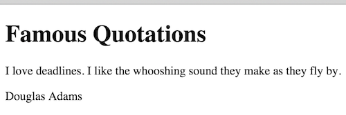
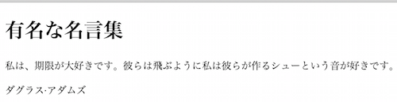

# Localizing JavaScript UI Text with RequireJS

Internationalizing a web application includes the task of extracting user interface text for translations. When text is separated from the rest of your application business logic, you are able to localize and translate it easier. Although the JavaScript language and browser environment don't prescribe any particular method for creating externalized text resources, many libraries exist to help this effort. One such library is [RequireJS](http://requirejs.org). The library includes an `i18n` plugin that helps you organize your text resources and load them at runtime depending on the needed language. The goal of this article is to describe how to use the RequireJS `i18n` plugin on a simple, single page application. 

This sample application has a single html file `index-before.html` that contains text headers and other UI elements. We will  extract the text, put it into a separate resource file, translate that file, and use the translatable files at runtime as needed by the customer's language.

NOTE: This is not a RequireJS tutorial. The article assumes that you have some RequireJS knowledge.

## Setting Up Your Environment

Download the [js-localization](https://github.com/joconner/i18n-examples/tree/master/js-localization) project on Github. The project contains the source code for this article, allowing you to see code both before and after using the `i18n` plugin.

The project's base directory is `js-localization`. Two HTML files are in this directory, `index-before.html` and `index-after.html`, which are the before- and after-internationalization files. The `scripts` subdirectory holds all JavaScript libraries for the project. All 3rd-party libraries, including RequireJS, are in `scripts/libs`. This application's primary application file is `scripts/main.js`. Externalized text bundles are in `scripts/nls`.

## Understanding the Original Index File

The original file looks like this:

    <html>
    <head>
        <meta charset="UTF-8">
        <title>Localization with RequireJS</title>
        <link href="styles/quotes.css" rel="stylesheet"/>
    </head>
    <body>
        <h1>Famous Quotation</h1>
        
I love deadlines. I like the whooshing sound they make as they fly by.

        
Douglas Adams

    </body>
    </html>

This file contains the following translatable items that we will extract for translation:

* The `title` element contents
* The `h1` element contents
* Two `p` element contents 
    
## Enabling Your HTML File

Include the RequireJS core library in your HTML file with a `script` element within the `head` section:
    
    
    
This script loads the `require` JavaScript file and also tells RequireJS to load your `main` module. The `main` module is the application's starting point. 

## Creating I18n Text Modules

We need to pull out the text and put it into a separate text resource bundle. We will create text resource bundles in the   `scripts/nls` subdirectory. RequireJS will look for resource bundles within the `nls` sudirectory unless you configure it otherwise. For our needs, we'll create `scripts/nls/text.js`, put all exported text there, and provide a key for each string. 

The updated HTML file maintains the same core document structure that is in the original file. However, we've removed the UI text. The HTML file, found in `index-after.html` now looks like this without text:

    <html>
    <head>
        <meta charset="UTF-8">
        <title id="titleTxt"></title>
        <link href="styles/quotes.css" rel="stylesheet"/>
        
    </head>
    <body>
        <h1 id="headerTxt"></h1>
        

        

    </body>
    </html>
    
Where is the text? It's in `scripts/nls/text.js`:

    define({
        "root": {
            "titleTxt": "Localization with RequireJS",
            "headerTxt": "Famous Quotations",
            "quoteTxt": "I love deadlines. I like the whooshing sound they make as they fly by.",
            "authorTxt": "Douglas Adams"
        }
    });

In general, each string in the original HTML file should be extracted into one or more `nls` resource bundles. The sole purpose of a resource bundle is to define localizable resources. The bundles that define your primary set of language key-values are called `root` bundles. As part of a root bundle, a resource bundle should define a `root` object that contains content for your application's base language. This application's root language is used when no target language can be found that matches the requested language. 

Every piece of localizable text should have a key. The key is used to extract the original and translated text from the bundles. For example, `headerTxt` contains the label for "Famous Quotations".

### Adding Translated Text

Now that you've separated text into one or more resource bundles, you can send those files away for translation. For each target language, you will create a subdirectory of the `nls` directory. In this example, I used Google Translate to translate the `text.js` content into Japanese and Spanish. The `nls` subdirectories that contain translations must be named using standard [BCP-47](http://joconner.com/2015/03/java-bcp47-language-tag/) language tags. The sub-directories for Japanese and Spanish are `nls/js` and `nls/es` respectively. Because there is only one source file, there will be only one file in each translation subdirectory.
 
### Informing the Library 

You must inform the RequireJS library about the available translations. In each source file that contains translations, you must add a language tag that matches the translation subdirectory name. We then have to update the `nls/text.js` file to notify the library for both Japanese and Spanish like this:

    define({
        "root": {
            "titleTxt": "Localization with RequireJS",
            "headerTxt": "Famous Quotations",
            "quoteTxt": "I love deadlines. I like the whooshing sound they make as they fly by.",
            "authorTxt": "Douglas Adams"
        },
        "es": true,
        "ja": true
    });
    
For each translation, you should include an additional language tag key in the root bundle. Since our root bundle `nls/text.js` has been translated into both Japanese and Spanish, we include those language tags and set their value to `true`, indicating that the translation exists.

### Configuring RequireJS

RequireJS determines your customer's language in one of two ways:

    1. It uses your browser's language setting via the `navigator.language` or `navigator.languages` object.
    2. It uses your customized, explicit configuration.
    
The `navigator.language` object is generally available across all browsers and represents the preferred language that is typically configurable in your browser's language settings. This may be a reasonable default language, but I don't recommend that a professional, consumer-facing application rely on this setting.

Instead, you should explicitly configure RequireJS to use a language that you select for the customer, with `navigator.language` as a backup perhaps. Your RequireJS configuration should be in the primary application JavaScript file. In our case, the `scripts/main.js` file contains this configuration as well as our application code.

If you set the `i18n.locale` configuration option for the `i18n` plugin, RequireJS will use that setting as your application's language. By setting the value of this field, you control what language RequireJS will attempt to use. Set the language/locale option in the `main.js` file like this:

    requirejs.config({
        config: {
            i18n: {
                locale: "en"
            }
        }
    });

In an actual application, you will not hard-code this locale setting. Instead, you will determine your customer's language another way, perhaps using `navigator.language` as a default.

## Accessing the Resource Bundle

Once things are configured, using the resource bundle is easy. You just have to include it as a module in your `main.js` file. Then, you access each key using the name you give the module.

    define(["jquery", "i18n!nls/text"],  function($, text) {
    
        // pull the text from the bundle and insert it into the document
        $("#titleTxt").append(text.titleTxt);
        $("#headerTxt").append(text.headerTxt);
        $("#quoteTxt").append(text.quoteTxt);
        $("#authorTxt").append(text.authorTxt);
    
    });
    
In the above case, I've required two modules: jquery and "i18n!nls/text". When you require a module using a plugin, you must append a "!" to the plugin name. After the plugin name, append the root resource bundle path. In this case, even though we have three languages, we point RequireJS to the root bundle. The `i18n` plugin will read the root bundle and discover the additional supported translations.

Since the code uses `text` as the module name, we can retrieve the text values by simply referencing the keys in the bundle. For example, if we want the `quoteTxt`, we reference it with `text.quoteTxt` in our code. The above code uses this technique to populate all the UI text in our simple HTML file. 

## Demonstrating the Plugin

We've setup the environment, configured the plugin, translated a file, and have modified our application so that it pulls translated text from the bundles. Now let's see this work. You shouldn't need any additional files or tools. Just point your browser to the `index-after.html` file on your local drive. If you've not changed anything, you should see the following English content:

Now if you update the `main.js` file and change the i18n.locale setting to `ja`, you will see the next image. Remember, this is not a professional translation and is only used for an example.

## Concluding

Although JavaScript has no predefined framework for providing translatable resources, it is reasonably easy to use a library like the RequireJS `i18n` plugin to help manage UI text strings. Interestingly, the Dojo libraries work similarly to RequireJS. So, if you're using Dojo, you will be manage translations in your application in much the same way.

Unfortunately, one of the most interesting parts of JavaScript internationalization is the question of how to determine the user's preferred language. I've written about this before, so instead of handling that question here, I'll refer you to [Language Signals on the Web](http://joconner.com/2012/02/language-signals-web/).

Good luck in your internationalization efforts. Like anything else, the hardest part is just getting started. Hopefully this article makes that first step easier.

