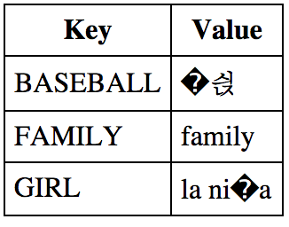
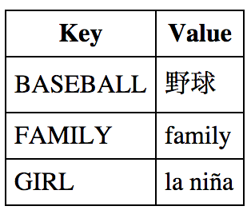

All text files have a character encoding regardless of whether you explicitly declare it. JavaScript files are no exception. This article describes both how and why you should declare an encoding when importing script files into an HTML document.

## JavaScript's Character Model
A JavaScript engine's internal character set is Unicode. The [Ecmascript 5.1 Standard](http://www.ecma-international.org/ecma-262/5.1) standard says that all strings are encoded in 16-bit code units described by [UTF-16](http://www.unicode.org/faq/utf_bom.html#utf16-1). Once inside the JavaScript interpreter, all characters and strings are stored and accessed as UTF-16 code units. However, before being processed by the JavaScript engine, a JavaScript file's charset can be anything, not necessarily a Unicode encoding.

## Character Encoding Conversion
When you import a JavaScript file into an HTML document, by default he browser uses the document's charset to convert the JavaScript file into the interpreter's encoding (UTF-16).  You can also use an explicit charset when importing a file. When an HTML file charset and a JavaScript file charset are different, you will most likely see conversion mistakes. The results are mangled, incorrect characters.

## Conversion Problems
I created a simple demonstration of the potential problem. The demo has 5 files: 

* jsencoding.html -- base HTML file, UTF-8 charset
* stringmgr.js -- a basic string resource mgr, UTF-8 charset
* resource.js -- an English JavaScript resource file containing the word _family_, UTF-8 charset
* resource_es.js -- a Spanish file containing the word _girl_, ISO-8859-1 charset
* resource_ja.js -- a Japanese file containing the word _baseball_, SHIFT-JIS charset

In the base HTML file, I've imported 3 JavaScript resource files using the following import statements:

        
        
        
        

The image shows how the text resources have been converted incorrectly. The browser imported the Spanish JavaScript file using the HTML file's UTF-8 encoding even though the file is stored using ISO-8859-1. The Japanese resource script is stored as SHIFT-JIS and doesn't convert correctly either.

After updating the import statements, we see a better result:

        
        
        

## Recommendations
To avoid charset conversion problems when importing JavaScript files and JavaScript resources, you should include the file charset. An even better practice is to use UTF-8 as your charset in all files, which minimizes these conversion problems significantly.

